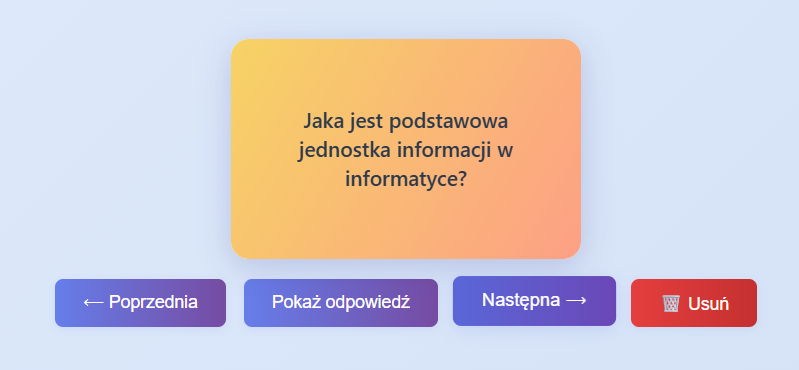
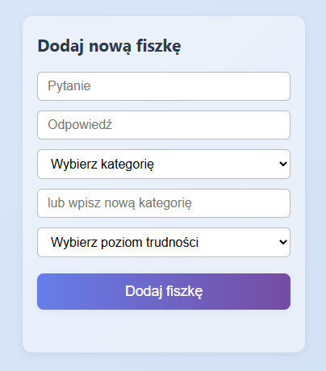
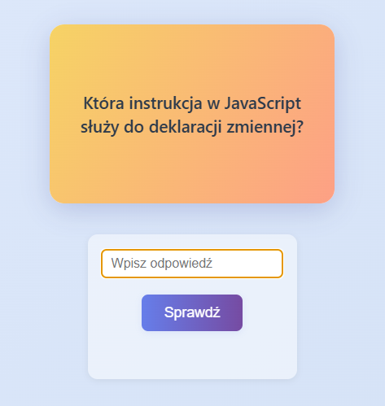

# 📚 Aplikacja do nauki z fiszkami

**FlashStudy** to aplikacja stworzona w Electron.js, która pomaga w skutecznej nauce przy użyciu fiszek. Idealna do szybkiego powtarzania materiału przed sprawdzianem, egzaminem czy prezentacją.

---

## ✨ Funkcje

- 📝 Dodawanie własnych fiszek (pytanie + odpowiedź)
- 📥 Import gotowych zestawów pytań
- 🎯 Tryb nauki z interaktywnym quizem
- 🗂️ Kategorie tematyczne (np. historia, biologia, języki)
- ⚙️ Różne tryby trudności (łatwy, średni, trudny)

---

## 🖼️ Zrzuty ekranu

### 📋 Lista fiszek według kategorii

---

### ➕ Formularz dodawania fiszek

---

### 🎓 Tryb nauki – quiz

---
